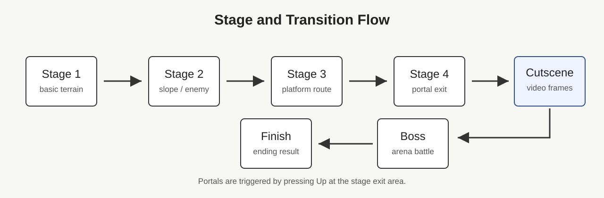
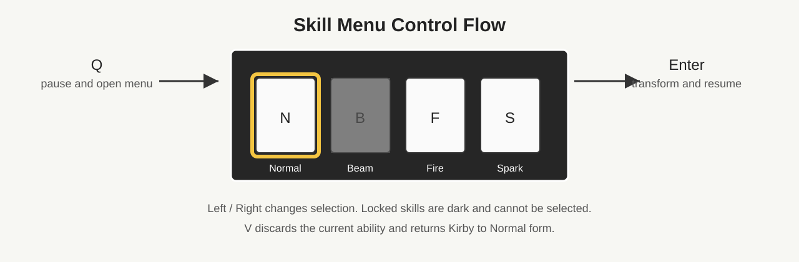

# Qt Kirby Adventure Code Report

## Table of Contents

1. [Introduction](#1-introduction)
2. [Game Specification & Design](#2-game-specification--design)
3. [System Architecture](#3-system-architecture)
4. [Core Mechanism Implementation](#4-core-mechanism-implementation)
5. [Technical Highlights](#5-technical-highlights)
6. [Difficulties and Improvements](#6-difficulties-and-improvements)
7. [Conclusion](#7-conclusion)

---

## 1. Introduction

本專案是一款以 Qt Graphics View Framework 製作的 2D 橫向卷軸動作遊戲，主題參考《星之卡比》的核心玩法，包含角色移動、跳躍、飛行、吸入敵人、吐出星星、能力取得、Boss 戰、道具回復、場景切換與背景音樂等內容。

整體程式以 `QGraphicsScene` 作為遊戲世界，`QGraphicsView` 作為顯示與攝影機視角，並透過 `QTimer` 以固定時間間隔驅動主要遊戲迴圈。玩家、敵人、子彈、Boss、地形與道具皆以 `QGraphicsItem` 系列類別呈現，使顯示、碰撞與座標管理能整合在同一套 Qt 架構中。

[Insert Figure Here]

圖 1. 遊戲畫面總覽或開始畫面截圖

本報告著重於系統設計與核心機制，說明專案如何將角色控制、碰撞判定、斜坡地形、Boss 行為、音效播放、能力系統與場景切換整合為完整的遊戲流程。

---

## 2. Game Specification & Design

### 2.1 Game Overview

本遊戲為使用 Qt Graphics View Framework 製作的 2D Kirby 動作遊戲。玩家控制 Kirby 在橫向捲動關卡中移動、跳躍、吸入敵人、取得能力，並在不同 stage 之間前進。新版流程不再只包含 Stage 1 與 Stage 2，而是加入 Stage 3、Stage 4 與 Boss 關卡，使遊戲流程由一般關卡、進階地形、過場動畫到 Boss 戰逐步展開。

| 項目 | 設計內容 |
| --- | --- |
| 遊戲類型 | 2D side-scrolling action game |
| 開發工具 | Qt / C++ |
| 主要框架 | `QGraphicsScene`, `QGraphicsView`, `QGraphicsPixmapItem` |
| 遊戲迴圈 | `QTimer` 每 16 ms 更新一次 |
| 主要玩法 | 移動、跳躍、飛行、吸入、吐星、能力變身、Boss 戰 |
| 關卡流程 | Start Menu, Stage 1, Stage 2, Stage 3, Stage 4, transition cutscene, Boss, Game Over, Finish |
| 新增系統 | portal stage switching, transition cutscene, Skill Menu |

圖 2-1. Stage 與 transition 流程圖

[TODO: screenshot - 遊戲主畫面或新版 stage 畫面]

### 2.2 Player Controls

玩家輸入由 `MainWindow::keyPressEvent()` 與 `MainWindow::keyReleaseEvent()` 處理，再依目前 `GameState` 決定是操作 Kirby、選單，或觸發關卡切換。新版增加 Skill Menu 操作：玩家可按 `Q` 暫停遊戲並開啟技能選單，使用左右鍵選擇已取得的能力，按 `Enter` 完成變身並返回遊戲；若要放棄目前能力，可按 `V` 回到 Normal 狀態。

| 按鍵 | 功能 |
| --- | --- |
| Left / Right | Kirby 左右移動 |
| Left / Right double tap | 衝刺 |
| Z | 跳躍 |
| Up | 進入 portal / stage transition；在場景出口位置觸發切換 |
| Down | 蹲下或配合其它動作使用 |
| X | 吸入、吐星或施放目前能力攻擊 |
| Q | 暫停遊戲並開啟 / 關閉 Skill Menu |
| Left / Right（Skill Menu） | 切換技能選項 |
| Enter（Skill Menu） | 選擇已解鎖技能並變身，返回遊戲 |
| V | 丟棄目前能力，回到 Normal 狀態 |
| Enter（Menu / Game Over） | 確認選單項目 |

圖 2-2. Skill Menu 操作流程圖

[TODO: screenshot - Skill Menu 開啟狀態，包含暗色 locked ability]

### 2.3 Level Design

關卡設計由原本的 Stage 1 與 Stage 2 擴充為多段式流程。Stage 1 保留基礎移動與敵人互動；Stage 2 加入斜坡、平台與更複雜的地形；Stage 3 與 Stage 4 進一步增加不同高度、平台間距與敵人配置；Stage 4 結束後先播放 transition cutscene，再進入 Boss 關卡。各 stage 的出口區域以 portal 條件判斷，玩家在指定位置按下 `Up` 後切換到下一個場景。

| 場景 | 主要內容 | 設計目的 |
| --- | --- | --- |
| Start Menu | 標題畫面與開始遊戲 | 進入遊戲流程 |
| Stage 1 | 基礎地形、WaddleDee / WaddleDoo / Gordo / HotHead | 讓玩家熟悉移動、吸入與基本敵人 |
| Stage 2 | 斜坡、平台、Sparky 與道具 | 增加地形變化與能力取得 |
| Stage 3 | 多段平台與較長的水平推進 | 延伸關卡節奏，保存玩家 HP、lives 與能力狀態 |
| Stage 4 | 高低落差、缺口與 portal 出口 | 銜接 Boss 前的最後一般關卡 |
| Transition Cutscene | Stage 4 到 Boss 前的影片過場 | 暫停操作並切換到 Boss 戰氣氛 |
| Boss Stage | Boss arena、炸彈與 BombStar 攻擊 | 完成主要挑戰 |
| Game Over / Finish | 結束畫面與結果流程 | 處理失敗或通關狀態 |

Stage 切換時會重新建立 scene 內的地形、敵人、道具、HUD 與玩家物件，但保留玩家的 HP、lives、目前型態與已解鎖技能。這樣可以避免跨場景物件殘留，同時讓玩家的進度在 stage 之間延續。

[TODO: screenshot - Stage 3 地形]

[TODO: screenshot - Stage 4 portal 位置]

---

## 3. System Architecture

### 3.1 Overall Architecture

系統仍以 `MainWindow` 作為主要控制中心，負責 `QGraphicsScene` 建立、`GameState` 切換、game loop、輸入處理、音樂控制與 entity list 管理。各角色與物件則維持在各自 class 中處理行為，例如 `Kirby` 控制玩家狀態、`Enemy` 及其子類別處理敵人邏輯、`Boss` 處理 Boss state machine，`AbilityMenu` 則負責技能選單的繪製、選取與解鎖狀態。

新版架構主要增加三個部分。第一是 stage loading function 擴充為 `loadStage3()`、`loadStage4()`、`loadStage4ToBossVideo()` 與 `loadBoss()`；第二是 transition cutscene 的播放流程，在進入 Boss 前暫停一般 game loop，改由 timer 更新過場影格；第三是 Skill Menu 作為 scene 上的高層 UI item，透過 `isMenuOpen` 控制遊戲暫停與選單輸入。

| 模組 | 主要 class / function | 職責 |
| --- | --- | --- |
| 主控制 | `MainWindow` | GameState、scene loading、game loop、input、audio |
| 玩家 | `Kirby` | 移動、碰撞、吸入、能力狀態、攻擊 signal |
| 技能選單 | `AbilityMenu` | 能力列表、左右選取、locked 顯示、解鎖狀態保存 |
| 關卡物件 | `Block`, `Slope`, `FloatingPlatform` | 地形與碰撞基礎 |
| 敵人 | `Enemy`, `WaddleDee`, `WaddleDoo`, `HotHead`, `Sparky`, `Gordo` | 敵人移動、攻擊與死亡狀態 |
| Boss | `Boss`, `Bomb`, `BombStar` | Boss 行為、炸彈生成、Boss 受擊 |
| UI | `HUD`, `AbilityMenu` | HP/lives 顯示與技能選擇 |
| 音樂 / 過場 | `QMediaPlayer`, `QMediaPlaylist`, transition timer | 背景音樂切換與過場播放 |

[TODO: screenshot - 架構圖或 Qt scene 物件關係圖]

### 3.2 Game Loop

主迴圈由 `QTimer` 每 16 ms 觸發，約等於 60 FPS。每次更新時會依序處理玩家、敵人、Boss、炸彈、子彈、碰撞、HUD 與攝影機位置。

主要流程如下：

1. 更新玩家狀態與吸入判定。
2. 更新所有敵人。
3. 更新 Boss，並接收 Boss 的炸彈生成請求。
4. 更新炸彈、炸彈星與一般星星子彈。
5. 判斷玩家與敵人、Boss、投射物之間的碰撞。
6. 更新 HUD 顯示。
7. 判斷生命值與 Game Over。
8. 讓攝影機跟隨玩家。

[Insert Figure Here]

圖 4. Game loop 更新流程圖

### 3.3 State Management

遊戲使用 `GameState` enum 管理目前場景，包括選單、關卡、Game Over 與結束狀態。當玩家在特定位置按下 Up 或 Enter 時，`MainWindow` 會呼叫對應的 `loadStage` 函式重建場景。

此設計的優點是流程清楚，每個場景的初始化集中在獨立函式中，例如 `loadStartMenu()`、`loadStage1()`、`loadStage2()`、`loadGameOver()` 與 `loadFinish()`。當切換場景時，程式會清除 scene、重置物件列表，再載入新的背景、地形、敵人、玩家與 HUD。

---

## 4. Core Mechanism Implementation

### 4.1 Character Movement

Kirby 的移動由速度、重力與狀態旗標共同控制。角色具有水平速度 `vx`、垂直速度 `vy`、重力 `gravity`，並透過 `isOnGround`、`isFlying`、`isDashing`、`isDown`、`isInhaling` 等狀態判斷可執行的動作。

| 機制 | 實作重點 |
| --- | --- |
| 水平移動 | 按左右鍵設定 `vx`，每幀更新 X 座標 |
| 衝刺 | 利用雙擊計時器判斷快速連按，將速度提高 |
| 跳躍 | 只有在地面且未吸入、未含物件時可設定向上速度 |
| 飛行 | 讓角色進入 `isFlying`，並套用較小重力與向上速度 |
| 蹲下 | 設定 `isDown`，停止衝刺，並可觸發部分能力變身 |
| 邊界限制 | 根據目前關卡寬度限制角色不能離開地圖 |

角色物理不是直接依賴 Qt 的內建物理引擎，而是在 `Kirby::update()` 中自行計算速度、位置與碰撞修正。這讓角色可以支援卡比遊戲常見的特殊行為，例如吸入時無法移動、飛行時重力變小、胖卡比狀態有較大的 hitbox。

[Insert Figure Here]

圖 5. Kirby 移動狀態與速度變化示意圖

### 4.2 Collision Detection

碰撞判定主要使用 Qt Graphics View 的 `collidingItems()` 與 `collidesWithItem()`。專案將碰撞分為 X 軸與 Y 軸處理，先更新水平位置並解決牆面碰撞，再更新垂直位置並處理落地、頂部碰撞、浮動平台與斜坡。

| 碰撞類型 | 判定方式 | 處理結果 |
| --- | --- | --- |
| 牆面碰撞 | X 軸移動後檢查 `Block` | 修正 X 座標並停止水平穿透 |
| 地面碰撞 | Y 軸下降時檢查 `Block` | 將角色放到地面上，`vy = 0` |
| 天花板碰撞 | Y 軸上升時檢查 `Block` | 停止向上速度並避免穿越 |
| 浮動平台 | 僅從上方落下時站立 | 可透過 Down + V 向下穿越 |
| 敵人碰撞 | 玩家與敵人 `collidesWithItem()` | 攻擊狀態擊殺敵人，否則受傷 |
| 子彈碰撞 | 子彈與敵人或 Boss 碰撞 | 子彈消失，目標受傷或死亡 |
| 道具碰撞 | bounding rect 交集 | 觸發補血或加命效果 |

玩家碰撞有一個值得注意的設計：顯示圖片大小與實際物理 hitbox 分開計算。程式會依照飛行、吐星、胖卡比等狀態調整物理寬高，再計算 offset，使視覺 sprite 與碰撞盒不必完全相同。這能讓動畫圖片較大時仍保持合理的操作手感。

[Insert Figure Here]

圖 6. Sprite 與實際 hitbox 關係示意圖

### 4.3 Slope System

斜坡系統由 `Slope` 類別實作，並繼承自 `Block`。不同於一般矩形地形，`Slope` 使用 `QPolygonF` 描述三角形或多邊形斜面。當 Kirby 與斜坡碰撞時，程式會根據角色腳底中心 X 座標計算斜坡表面的 Y 值，再把角色放置到該表面上。

斜坡高度計算的核心概念如下：

1. 將 Kirby 的 scene X 座標轉為斜坡 local X。
2. 遍歷 polygon 的每一條邊。
3. 找出 X 座標位於該邊範圍內的線段。
4. 使用線性插值計算該 X 對應的 Y。
5. 回傳 scene 座標中的表面高度。

| 設計項目 | 說明 |
| --- | --- |
| 地形表示 | 使用 `QPolygonF` 定義斜坡形狀 |
| 表面計算 | 以腳底中心 X 對斜坡邊線做線性插值 |
| 接觸判斷 | 角色下降且腳底穿越表面時視為落在斜坡 |
| 狀態紀錄 | 以 `MoveMode::SlopeMode` 標記正在斜坡上 |
| 容錯處理 | 使用 epsilon 與 fallback 避免邊界誤判 |

Stage 2 中大量使用斜坡組合地形，讓場景不只是平面平台，而能呈現更自然的上下坡路線。

[Insert Figure Here]

圖 7. 斜坡 polygon 與表面高度插值示意圖

### 4.4 Boss System

Boss 系統由 `Boss` 類別負責，採用有限狀態機設計。Boss 具有固定 arena 範圍、重力、速度、血量、動畫圖片與血條。其行為不是單一追蹤玩家，而是由數個狀態構成循環，使 Boss 戰有節奏感。

| Boss 狀態 | 行為 |
| --- | --- |
| `SmallHop` | 在 arena 內小跳移動 |
| `BigJumpToKirby` | 朝 Kirby 方向大跳 |
| `JumpBack` | 遠離 Kirby 後跳 |
| `VerticalHopPrepare` | 垂直跳起，準備投擲炸彈 |
| `DropBomb` | 完成炸彈投擲流程後回到小跳 |
| `Hurt` | 預留受傷狀態 |
| `Dead` | Boss 被擊敗並隱藏 |

Boss 投擲炸彈時不直接在自身類別中新增場景物件，而是設定 `bombSpawnRequested`，由 `MainWindow::gameLoop()` 呼叫 `consumeBombSpawnRequest()` 取得位置與速度，再建立 `Bomb` 物件。這種做法讓 Boss 專注於行為決策，而實際物件管理仍由主控場景負責。

玩家吸入 Boss 炸彈後，會進入 `hasBombInMouth` 狀態，再按攻擊鍵可吐出 `BombStar`。`BombStar` 撞到 Boss 時造成傷害並播放爆炸流程，形成 Boss 戰的主要攻擊循環。

[Insert Figure Here]

圖 8. Boss 狀態機與炸彈攻擊流程圖

### 4.5 Sound System

音效系統使用 `QMediaPlaylist` 與 `QMediaPlayer` 播放背景音樂。主選單、關卡與結束畫面分別加入 playlist 的不同 index，切換場景時透過 `setCurrentIndex()` 切換音樂，再呼叫 `play()` 播放。

| Playlist Index | 音樂用途 |
| --- | --- |
| 0 | Start Menu 主題音樂 |
| 1 | Stage 背景音樂 |
| 2 | Finish 結束音樂 |

程式也考慮了執行檔位置不同的問題，會嘗試兩種路徑尋找音樂檔案：一種是從 build 輸出資料夾往回找專案資料夾，另一種是直接從執行目錄中的 `bg_music` 資料夾讀取。這讓專案在 Qt Creator 或不同部署方式下較容易找到音樂資源。

[Insert Figure Here]

圖 9. 場景與背景音樂切換示意圖

### 4.6 Ability System

能力系統由 Kirby 的 form / ability 狀態與 `AbilityMenu` 共同管理。Kirby 仍透過吸入敵人或特殊物件取得能力，並依目前能力決定可使用的攻擊方式。新版加入 Skill Menu 後，玩家不需要只依賴當下吸入狀態，也可以在已解鎖能力之間切換。

`AbilityMenu` 目前包含 Normal、Beam、Fire、Spark 四個選項，內部以 `QVector<bool> unlocked` 紀錄每個能力是否已取得。尚未取得的能力會在選單中以暗色覆蓋顯示，並且按下 `Enter` 時不會生效。已取得的能力可使用左右鍵選取，再按 `Enter` 套用到 Kirby 的 form。

| 能力 | 解鎖 / 取得來源 | 選單行為 | Kirby 狀態 |
| --- | --- | --- | --- |
| Normal | 預設可用 | 永遠可選 | 回到一般型態 |
| Beam | 取得對應能力後解鎖 | locked 時暗色且不可選 | `BeamForm` |
| Fire | 吸入 HotHead 或取得火焰能力後解鎖 | unlocked 後可選 | `FireForm` |
| Spark | 吸入 Sparky 或取得電擊能力後解鎖 | unlocked 後可選 | `Sparky` / spark form |

技能選單開啟時，`MainWindow` 會將一般操作切換成選單操作，避免玩家角色在選單中仍然移動或攻擊。按下 `Q` 可開啟選單並暫停遊戲，按下 `Enter` 後套用選取能力並恢復遊戲；按下 `V` 則直接丟棄目前能力，使 Kirby 回到 Normal 狀態。切換 stage 時，`currentUnlocked` 會保存已解鎖技能，避免重新載入 scene 後遺失能力進度。

圖 4-6. Skill Menu 與能力切換流程

[TODO: screenshot - Fire / Spark / Beam 至少一個已解鎖的 Skill Menu]

### 4.7 Scene Switching

場景切換由 `GameState` 與各 `load...()` function 控制。玩家在 stage 結尾的 portal 區域按下 `Up` 後，`MainWindow::keyPressEvent()` 會檢查玩家位置與目前狀態，再切換到下一個 state 並呼叫對應的載入函式。新版流程為 Stage 1 -> Stage 2 -> Stage 3 -> Stage 4 -> transition cutscene -> Boss。

切換場景時會先停止 timer，保存玩家 HP、lives、目前 form 與 Skill Menu unlocked 狀態，接著清除 scene、projectile list、enemy list 與 Boss 物件，再重新設定 `sceneRect`、背景、地形、敵人、道具、HUD 與玩家位置。完成後重新連接 Kirby 的 projectile signal，最後啟動 game loop。

Stage 4 到 Boss 之間加入 transition cutscene。此階段不建立玩家操作物件，而是清除原 stage 後播放過場畫面，待過場播放完畢後將 `currentState` 設為 `STATE_BOSS` 並呼叫 `loadBoss()`。背景音樂也配合場景狀態切換，避免一般關卡音樂與 Boss / 結束流程混在一起。

| 切換來源 | 觸發條件 | 下一狀態 |
| --- | --- | --- |
| Stage 1 | 玩家在出口區域按 `Up` | Stage 2 |
| Stage 2 | 玩家在上方出口區域按 `Up` | Stage 3 |
| Stage 3 | 玩家在出口區域按 `Up` | Stage 4 |
| Stage 4 | 玩家在 portal 區域按 `Up` | Transition Cutscene |
| Transition Cutscene | 過場播放結束 | Boss Stage |
| Boss Stage | Boss 戰結束 | Finish |

圖 4-7. Stage switching 與過場切換流程

[TODO: screenshot - Stage 4 to Boss transition cutscene 畫面]

---

## 5. Technical Highlights

### 5.1 State-Based Stage Loading

新版關卡流程透過 `GameState` 將 Start Menu、Stage 1-4、transition cutscene、Boss、Game Over 與 Finish 分開管理。每個 stage 使用獨立的 `loadStage...()` function 建立地形、背景、敵人與道具，因此各關卡可以維持不同配置，也降低單一載入函式過長造成的維護困難。

### 5.2 Portal-Driven Scene Switching

Stage 之間不是自動切換，而是在特定出口區域檢查玩家座標、落地狀態與 `Up` 鍵輸入。這種方式讓 portal 的判斷集中在 input handling 中，並能避免玩家只是經過出口區域就誤觸切換。

### 5.3 Transition Cutscene Before Boss

Stage 4 進入 Boss 前加入 transition cutscene。過場播放時會停止一般 game loop，清除 stage 物件，並以 timer 逐格更新過場畫面。播放結束後再切換到 Boss state，讓 Boss 關卡載入與過場結束有明確邊界。

### 5.4 Persistent Player State Across Stages

每次切換 stage 前會保存玩家 HP、lives、目前 form 與 Skill Menu unlocked 狀態。重新建立 Kirby 物件後，再把這些狀態套回新場景中的玩家，使 scene 可以安全重建，同時保留玩家實際進度。

### 5.5 Skill Menu With Locked Ability Feedback

Skill Menu 使用獨立的 `AbilityMenu` item 繪製在 scene 上方。尚未取得的能力以半透明暗色遮罩表示，選取框則標示目前游標位置。這讓能力是否可用可以直接由 UI 表達，按下 `Enter` 時也會再檢查 unlocked 狀態，避免未解鎖能力被套用。

### 5.6 Separation Between Main Control and Entity Behavior

`MainWindow` 負責流程控制、scene 管理與 signal 連接；Kirby、Enemy、Boss、Projectile 與 UI item 則各自處理自己的狀態與繪製。新增 stage、cutscene 與 Skill Menu 後仍維持這個分工，避免把角色行為直接寫進 stage loading 流程。

### 5.7 Qt Resource and Media Management

背景、角色圖、技能 icon 與音樂多數透過 Qt resource path 或執行檔相對路徑載入。音樂使用 `QMediaPlaylist` 與 `QMediaPlayer` 控制，在 menu、stage、finish 等流程中切換播放內容；transition cutscene 則配合場景切換同步處理播放節奏。

---

## 6. Difficulties and Improvements

### 6.1 Stage Loading Duplication

新增 Stage 3、Stage 4 與 Boss 後，各 `loadStage...()` function 都需要建立背景、地形、玩家、HUD、敵人與 signal 連接，程式結構比原本兩個 stage 時更容易重複。後續可將共通流程整理成 `StageBuilder` 或 `LevelData`，讓每個 stage 只描述差異，例如背景、地形列表、敵人座標與 portal 條件。

### 6.2 Scene Object Lifetime

場景切換時需要同時處理 `scene->clear()`、projectile list、enemy list、Boss 指標與玩家指標。如果某個 list 沒有同步清除，可能造成殘留指標或物件重複更新。後續可加入統一的 scene cleanup function，集中管理清除順序與 pointer reset。

### 6.3 Transition Cutscene Synchronization

過場動畫需要和 game loop、scene loading 以及背景音樂切換同步。如果 timer 停止或 state 更新順序不一致，可能出現過場尚未結束就能操作、或進入 Boss 後音樂沒有正確切換的問題。後續可將 cutscene 包成獨立 manager，提供 `playCutscene(name, nextState)` 之類的介面。

### 6.4 Skill Menu Input State

Skill Menu 開啟後，左右鍵與 Enter 的意義會從角色操作改成 UI 操作，因此 `isMenuOpen` 必須正確阻擋一般輸入與 game loop 更新。後續可把 menu 狀態納入更完整的 game state machine，讓 pause、menu、cutscene、playing 等狀態更明確。

### 6.5 Ability System Expansion

目前能力選單已能顯示 locked 狀態並切換已解鎖能力，但能力本身仍主要由 Kirby form 判斷。若未來能力數量增加，可以把每種能力拆成獨立 class，統一提供 `activate()`、`update()`、`cancel()` 與 icon 資訊，減少 Kirby 內部的條件判斷。

### 6.6 Debug Output and Testing

目前仍有較多 `qDebug()` 用於觀察 HP、座標、Boss 與 projectile 狀態。後續可加入 debug flag 或 log level，讓 release 版本關閉大量輸出。同時也可針對 stage transition、能力解鎖保存、Skill Menu locked selection 等流程建立測試清單，避免新增關卡後破壞既有功能。

---

## 7. Conclusion

本專案完成了一個具備完整遊戲流程的 Qt 2D 動作遊戲原型。系統以 `MainWindow` 作為主控，透過 `QGraphicsScene` 管理場景物件，並以 `QTimer` 驅動穩定的 game loop。玩家角色 Kirby 擁有移動、跳躍、飛行、吸入、吐星、能力轉換與受傷復活等核心行為；敵人、Boss、道具、地形與 HUD 也各自形成清楚的模組。

從技術角度來看，本專案的重點不只是顯示角色與背景，而是實作了多個動作遊戲需要的核心系統：分軸碰撞判定、動態 hitbox、polygon 斜坡、Boss 有限狀態機、場景狀態切換、背景音樂播放，以及基於吸入行為的能力系統。這些設計讓遊戲已具備從開始、遊玩、戰鬥到結束的完整結構。

後續若要進一步提升，可優先將關卡資料、碰撞系統、音效系統與能力系統模組化，使新增關卡、敵人與能力時更容易維護。整體而言，本專案已展現 Qt/C++ 在 2D 遊戲開發上的可行性，也建立了可持續擴充的遊戲基礎。

[Insert Figure Here]

圖 12. 最終遊戲成果或系統整合展示圖
